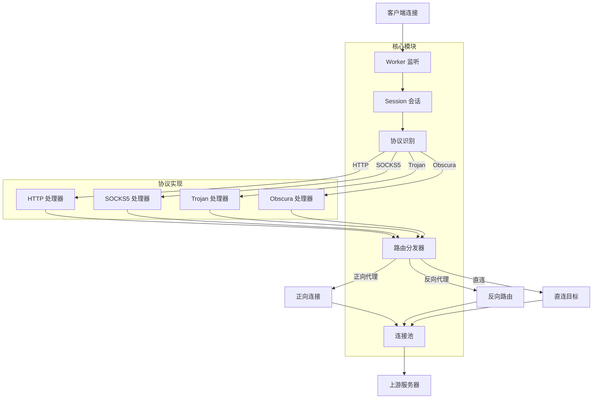

# ForwardEngine

<div align="center">


</div>

## 概述

ForwardEngine 是一个基于 Modern C++（C++23）与 Boost.Asio/Beast 的高性能代理引擎，核心链路使用 `net::awaitable` 协程组织，提供低延迟、高并发的网络转发能力。项目采用模块化设计，支持多种代理协议，适用于代理网关、网络中间件和隐私保护等场景。

## ✨ 核心特性

### 协议支持
- **HTTP/HTTPS 代理**：完整支持 HTTP 正向代理与 HTTPS `CONNECT` 隧道
- **SOCKS5 代理**：标准 SOCKS5 协议（无认证/TCP Connect），支持 IPv4/IPv6/域名
- **Trojan 代理**：Trojan 协议（TLS + 类 HTTP 伪装），支持密码验证
- **Obscura 隧道**：基于 WebSocket + TLS 的传输层伪装通道

### 技术架构
- **协程驱动**：基于 Boost.Asio 的 `net::awaitable` 协程，无回调地狱
- **内存管理**：统一 PMR（Polymorphic Memory Resource）策略，支持全局池化与帧分配器
- **连接复用**：智能 TCP 连接池，支持僵尸检测、空闲超时与上限控制
- **协议识别**：动态协议检测（peek），自动适配 HTTP/SOCKS5/Trojan/Obscura
- **双向转发**：优化的隧道转发算法，支持优雅退出与资源及时回收

### 开发体验
- **现代 C++**：全面使用 C++23 特性（`std::expected`、概念约束、协程等）
- **模块化设计**：清晰的接口边界，易于扩展新协议
- **完整测试**：包含单元测试、集成测试与端到端验证
- **生产级日志**：基于 spdlog 的异步日志系统，支持文件轮转与级别控制

## 🏗️ 系统架构



## 🚀 快速开始

### 环境要求
- **编译器**：支持 C++23 的编译器（GCC 13+、Clang 16+、MSVC 2022+）
- **构建系统**：CMake 3.20+
- **依赖库**：
  - Boost 1.82+（Asio、Beast）
  - OpenSSL 3.0+
  - spdlog 1.12+
  - glaze 2.0+

### Windows 构建（MinGW）
依赖默认从 `c:/bin` 查找（根目录 `CMakeLists.txt` 已配置路径）：

```bat
# 配置项目
cmake -S . -B build_release -G "MinGW Makefiles" -DCMAKE_BUILD_TYPE=RelWithDebInfo

# 编译
cmake --build build_release -j

# 运行测试
ctest --test-dir build_release --output-on-failure
```

### Linux/macOS 构建
```bash
# 配置项目
cmake -S . -B build_release -DCMAKE_BUILD_TYPE=RelWithDebInfo

# 编译
cmake --build build_release -j

# 运行测试
ctest --test-dir build_release --output-on-failure
```

### 运行代理服务器
程序运行时会读取 `src/configuration.json`，默认监听端口为 `8081`：

```bat
build_release/src/Forward.exe
```

### 验证代理功能
使用 curl 测试代理功能：

```bat
# HTTP/HTTPS 代理
curl -v -L -x http://127.0.0.1:8081 http://www.baidu.com
curl -v -L -x http://127.0.0.1:8081 https://www.baidu.com

# SOCKS5 代理
curl -v -L -x socks5://127.0.0.1:8081 http://www.baidu.com

# 使用环境变量
set HTTP_PROXY=http://127.0.0.1:8081
curl -v http://www.baidu.com
```

## ⚙️ 配置说明

配置文件位于 `src/configuration.json`，主要配置项：

### 代理服务配置
```json
{
  "agent": {
    "addressable": {
      "host": "localhost",
      "port": 8081
    },
    "certificate": {
      "cert": "cert.pem",
      "key": "key.pem"
    }
  }
}
```

### 日志配置
```json
{
  "trace": {
    "enable": true,
    "log_level": "info",
    "console": true,
    "file": {
      "enable": true,
      "path": "logs/forward_engine.log",
      "max_size": 10485760,
      "max_files": 5
    }
  }
}
```

### 连接池配置
```json
{
  "agent": {
    "connection": {
      "max_idle_time": 300,
      "max_per_endpoint": 10,
      "zombie_check_interval": 30
    }
  }
}
```

## 📁 目录结构

```
ForwardEngine/
├── include/forward-engine/          # 公共头文件
│   ├── agent/                       # 代理核心逻辑
│   │   ├── session.hpp              # 会话生命周期
│   │   ├── worker.hpp               # 监听与连接接受
│   │   ├── analysis.hpp             # 协议识别与目标解析
│   │   ├── distributor.hpp          # 路由分发
│   │   └── connection.hpp           # 连接池管理
│   ├── protocol/                    # 协议实现
│   │   ├── http/                    # HTTP 协议
│   │   ├── socks5/                  # SOCKS5 协议
│   │   └── trojan/                  # Trojan 协议
│   ├── transport/                   # 传输层封装
│   │   ├── obscura.hpp              # Obscura 隧道
│   │   └── adaptation.hpp           # 统一适配层
│   ├── memory/                      # 内存管理
│   │   ├── container.hpp            # 容器别名
│   │   ├── pool.hpp                 # 内存池
│   │   └── pointer.hpp              # 智能指针封装
│   ├── trace/                       # 日志系统
│   │   ├── spdlog.hpp               # spdlog 封装
│   │   └── monitor.hpp              # 协程监控
│   └── transformer/                 # 数据转换
│       └── json.hpp                 # JSON 序列化
├── src/forward-engine/              # 实现文件
├── test/                            # 测试文件
└── docs/                            # 文档
```

## ⚡ 性能特征

### 设计优化
1. **零拷贝转发**：隧道阶段使用 `boost::asio::buffer` 引用传递，避免数据复制
2. **协程栈复用**：`net::awaitable` 协程栈空间复用，减少内存分配
3. **连接复用**：TCP 连接池减少握手开销，提高响应速度
4. **内存池化**：PMR 内存管理减少堆分配碎片


## 📚 文档

详细的用户指南和开发文档位于 `docs/` 目录：

- [综合指南](docs/premise.md) - 包含快速入门、用户指南、常见问题和技术概述
- [开发进度](docs/progress.md) - 项目开发状态、贡献指南和路线图

## ⚠️ 已知限制

### 当前版本限制
- 连接池目前仅覆盖 TCP 协议
- UDP 转发支持尚未实现
- 反向代理路由表配置需手动更新
- 跨线程连接池共享策略仍在完善中

### 平台兼容性
- 已在 Windows 11 + MinGW 上全面测试
- Linux/macOS 平台需要适配部分路径配置
- ARM 架构尚未验证

## 📄 许可证

本项目采用 MIT 许可证 - 查看 [LICENSE](LICENSE) 文件了解详情。

## 🙏 致谢

感谢以下开源项目提供的强大支持：
- [Boost.Asio/Beast](https://www.boost.org/) - 异步 I/O 和 HTTP/WebSocket 实现
- [OpenSSL](https://www.openssl.org/) - 加密和 TLS 支持
- [spdlog](https://github.com/gabime/spdlog) - 高性能日志库
- [glaze](https://github.com/stephenberry/glaze) - 快速的 JSON 序列化

---

<div align="center">
  
**ForwardEngine** - 为现代网络而生的高性能代理引擎

</div>