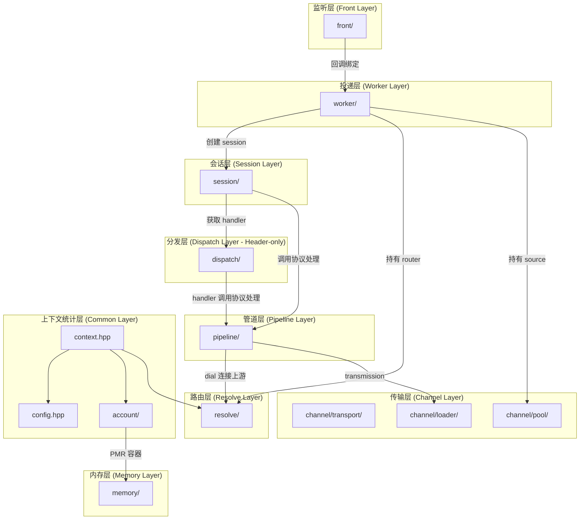
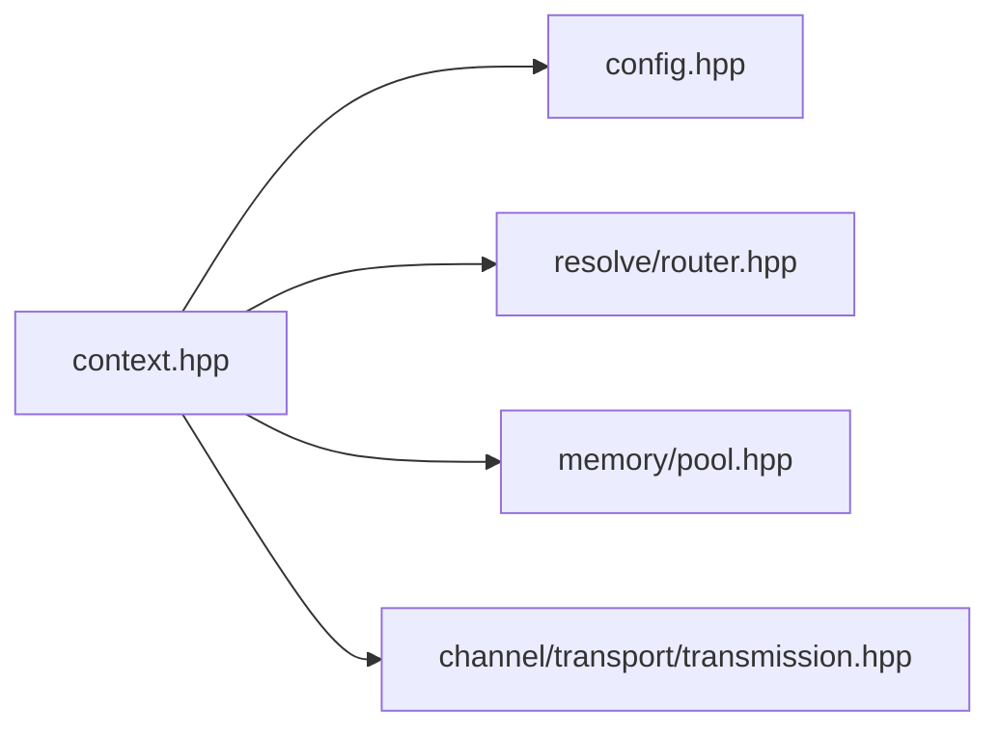
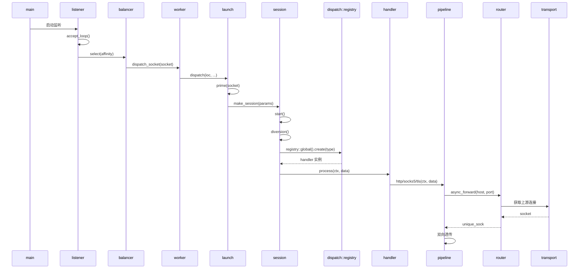

# Agent 模块依赖关系文档

## 目录结构

源码目录：

```
agent/
├── account/      # 账户管理
├── session/      # 会话管理
├── resolve/      # 分发路由
├── dispatch/     # 协议分发
├── front/        # 前端监听
├── pipeline/     # 协议管道
└── worker/       # 工作线程
```

---

## 目录依赖图



---

## 上下文统计层

横向公共层提供跨模块的共享服务和配置：

| 模块 | 职责 | 被使用方 |
|------|------|----------|
| account | 账户注册表、用户凭据管理、连接配额控制 | main、worker、session |
| context | 运行时上下文聚合（server_context、worker_context、session_context） | worker、session、pipeline |
| config | 代理服务配置参数 | context、listener、worker |

### context.hpp 依赖关系



---

## Header-only 层

`dispatch` 目录是纯 header-only 层，特点如下：

- **位置**: `include/forward-engine/agent/dispatch/`
- **文件**: `handler.hpp`, `handlers.hpp`
- **无源文件**: 不存在 `src/forward-engine/agent/dispatch/` 目录
- **设计原因**: 协议处理器为轻量级单例，模板工厂方法需要内联实现

### dispatch 模块结构

```
include/forward-engine/agent/dispatch/
├── handler.hpp    # handler 基类 + registry 工厂
└── handlers.hpp   # Http/Socks5/Tls/Unknown 具体实现
```

---

## 运行时调用图



---

## 模块职责说明

### front 层

| 组件 | 职责 |
|------|------|
| listener | 监听指定端口，接受入站 TCP 连接，计算客户端亲和性值 |
| balancer | 负载均衡器，根据负载快照选择目标 worker，支持反压机制 |

### worker 层

| 组件 | 职责 |
|------|------|
| worker | 工作线程核心，持有 io_context、router、source、统计状态 |
| launch | 连接分发与会话启动，socket 预配置、会话创建 |
| stats | 负载统计，活跃会话计数、事件循环延迟监控 |
| tls | TLS 上下文管理，证书加载、SSL 配置 |

### session 层

| 组件 | 职责 |
|------|------|
| session | 会话生命周期管理，协议检测、分流处理、资源清理 |

### dispatch 层

| 组件 | 职责 |
|------|------|
| handler | 协议处理器抽象基类，定义 process/type/name 接口 |
| registry | 协议处理器工厂，支持动态注册和单例创建 |
| handlers | 具体协议处理器实现，防止大量switch语句难以维护（Http、Socks5、Tls、Unknown） |

### pipeline 层

| 组件 | 职责 |
|------|------|
| protocols | 协议处理类（http、socks5、tls） |
| primitives | 基础传输，忙转发（original_tunnel、relay） |

### resolve 层

| 组件 | 职责 |
|------|------|
| router | 分发路由器门面，整合仲裁器、解析器、黑名单 |
| arbiter | 反向代理路由分发，主机名到端点映射 |
| tcpcache | TCP DNS 缓存，请求合并 |
| udpcache | UDP DNS 缓存，请求合并 |

### account 层

| 组件 | 职责 |
|------|------|
| directory | 账户注册表，用户凭据存储、连接配额管理 |
| entry | 账户条目，单用户信息封装 |

---

## 关键依赖路径

### 启动路径

```
main → listener.listen() → balancer.select() → worker.dispatch_socket()
```

### 会话创建路径

```
worker → launch.dispatch() → launch.prime() → make_session() → session.start()
```

### 协议处理路径

```
session.diversion() → registry.create() → handler.process() → pipeline::*()
```

### 上游连接路径

```
pipeline → router.async_forward() → source.acquire() → transport
```

---

## 线程安全说明

| 组件 | 线程安全 | 说明 |
|------|----------|------|
| listener | 单线程 | 运行在独立 io_context |
| balancer | 线程安全 | 原子操作负载快照 |
| worker | 单线程 | 仅 dispatch_socket 线程安全 |
| session | 单线程 | 通过 shared_from_this 保活 |
| router | 单线程 | 应在 单线程 上下文使用 |
| registry | 初始化后只读 | 注册阶段非线程安全 |
| directory | 线程安全 | 内部使用原子操作保护 |
